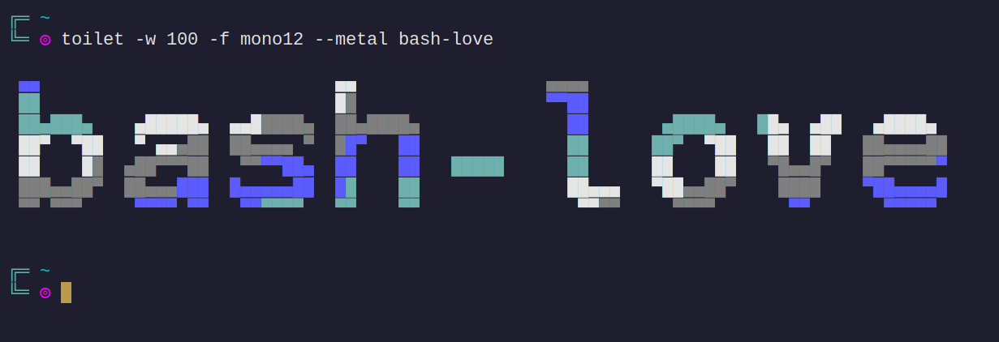
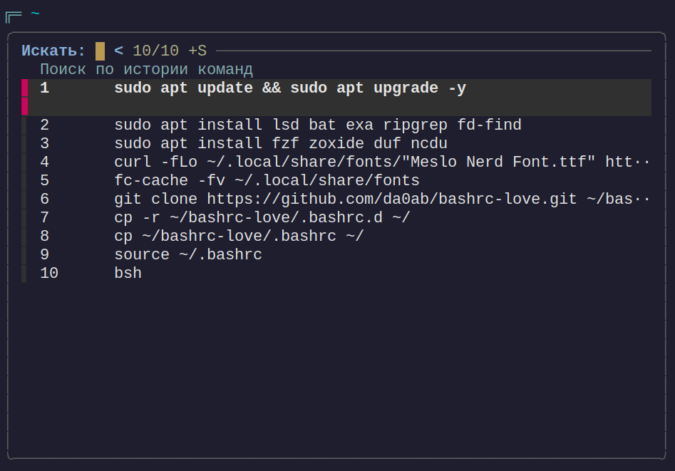
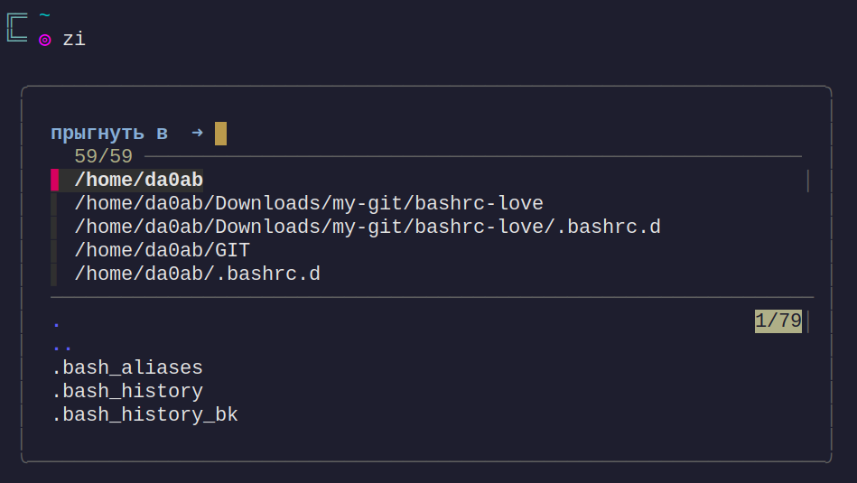

# BASHRC-LOVE






## Структура

```bash
.bashrc
[].bashrc.d/
├──  01-exports.sh
├──  02-history.sh
├──  03-aliases.sh
├──  04-autocomplit.sh
├──  05-fzf-lsd-zoxide.sh
├──  06-prompt.sh
├──  07-superfile.sh
├──  08-lf.sh
└──  09-functions.sh
```

## Скрипт установки

``install-bashrc-love.sh``

``chmod +x install-bashrc-love.sh``


## Алиасы

### Навигация
- `..` - на уровень выше
- `...` - на два уровня выше

### Файлы
- `l` - дерево (1 уровень)
- `ll` - подробный список
- `la` - подробно со скрытыми
- `lt` - полное дерево

### Система
- `t` - дата и календарь
- `pa` - все процессы
- `k` - убить процесс
- `kk` - убить все процессы
- `kkk` - принудительно убить

### Оболочка
- `bsh` - перезагрузить bashrc
- `bin` - сделать исполняемым
- `c` - очистить экран
- `q` - выйти

### Редакторы и файловые менеджеры
- `vv` - vim
- `gg` - gvim
- `sv` - sudo gvim
- `ff` - lf
- `ss` - spf

### Мультимедиа
- `mm` - mocp
- `m` - alsamixer
- `sz` - скриншот области

### Python
- `ppp` - python3

### Git
- `gs` - статус
- `gc` - клонировать
- `mk` - собрать и установить

### Пакеты
- `new` - обновить систему
- `inst` - установить пакет
- `deb` - установить .deb
- `list` - редактировать sources.list

### Инфо
- `comp` - отчет о системе
- `about` - информация о системе


## Плагины
- ``Ctrl+r `` – замена встроенного поиска по истории
- ``zi`` – поиск по сохраненным путям
- ``fzf`` – поиск


-------

### [fzf](https://github.com/junegunn/fzf)

`` git clone --depth 1 https://github.com/junegunn/fzf.git ~/.fzf ``

Инсталляция `` ~/.fzf/install ``

### [zoxide](https://github.com/ajeetdsouza/zoxide)

### [lsd](https://github.com/lsd-rs/lsd)

### NerdFonts

``
mkdir -p ~/.local/share/fonts/NerdFonts
curl -fLo ~/.local/share/fonts/NerdFonts/"Meslo Nerd Font.ttf" \
    https://github.com/ryanoasis/nerd-fonts/raw/master/patched-fonts/Meslo/M/Regular/complete/Meslo%20LG%20M%20Regular%20Nerd%20Font%20Complete.ttf
``

